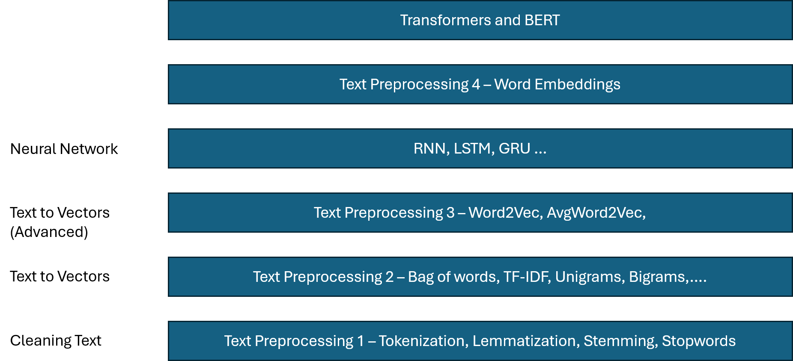
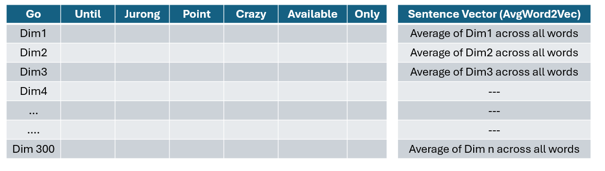

# NLP for Machine Learning



Example/UseCases = Auto Correct, In any messaging bots we get suggestions for the message reply. Language Translation, Text Classifications etc..

### Topics:

- **Corpus**: A large and structured collection of text (or speech) data used for language analysis and training models.
Example: All Wikipedia articles, A dataset of movie reviews
- **Documents**: A **document** is a single unit of text inside a corpus.
Example: If your corpus = 100 emails, Then each email = 1 document
- **Vocabulary**: A **vocabulary** is the set of all unique words in the corpus.
Example: Corpus: "I love NLP. NLP is fun." → Vocabulary: {I, love, NLP, is, fun}
- **Words (Tokens)**: Words (or **tokens**) are the basic units of text after processing.
Example: Sentence: "NLP is amazing!"  Tokens: ["NLP", "is", "amazing", "!"] These are the smallest pieces used for analysis.

# Tokenization:

**Tokenization** is the process of breaking text into smaller units called **tokens**.
Tokenization: converts text to into format machines can understand.

## Tokens:

Tokens are the basic building blocks of text. They can be:

- Words
- Sentences
- Characters
- Subwords

 Types of Tokenization:

- Word Tokenization: Splits text into words.
"Machine learning is fun" → ["Machine", "learning", "is", "fun"]
- Sentence Tokenization: Splits text into sentences.
"Hello world. NLP is cool.” → ["Hello world.", "NLP is cool."]
- Character Tokenization: Splits into individual characters.
"Hi” → ["H", "i"]
- Subword Tokenization (advanced): Used in modern NLP models (like BERT, GPT)
"unhappy" → ["un", "happy"]

> Ref: https://github.com/BharatKumarNaik/NLP/blob/master/Tokenization.ipynb
> 

## Stemming

It’s the process of reducing a word to its word stem that affixes to suffixes and prefixes or to the root of words known as a lemma. Stemming is important in natural language understanding (NLU) and natural language processing (NLP)

### Example

Original sentence:

> "The students are studying and studied hard for their studies."
> 

After stemming:

| Original Word | Stem |
| --- | --- |
| students | student |
| studying | studi |
| studied | studi |
| studies | studi |

Notice that the stem **"studi"** is not a valid English word. Stemming focuses on reducing words mechanically, not necessarily producing meaningful dictionary words.

### Popular Stemming Algorithms

1. **Porter Stemmer**
    - Most widely used.
    - Applies a series of suffix-removal rules.
2. **Snowball Stemmer**
    - Improved version of Porter Stemmer.
    - Supports multiple languages.
3. **Lancaster Stemmer**
    - More aggressive.
    - Produces shorter stems.

### Advantages

- Reduces vocabulary size.
- Improves search and document matching.
- Faster text processing.

### Disadvantages

- Can produce meaningless stems (e.g., *studi*).
- Different words may incorrectly map to the same stem.
- Less accurate than lemmatization for understanding meaning.

> Ref: https://github.com/BharatKumarNaik/NLP/blob/master/Stemming.ipynb
> 

## Lemmatization

**Lemmatization** is an NLP technique that converts a word to its **lemma**, which is its dictionary or canonical form. Unlike stemming, lemmatization considers the word's meaning and grammatical context, so it usually produces valid words.

| Stemming | Lemmatization |
| --- | --- |
| Removes suffixes using rules | Uses vocabulary and grammar |
| Faster | Slower |
| May produce non-words | Produces valid dictionary words |
| Example: "studies" → "studi" | "studies" → "study" |

But it’s slower than the stemming technique, as it tries to get the root word from WordNet corpus.

- **Need speed and simpler matching? → Use Stemming**
- **Need accurate language understanding? → Use Lemmatization**

So, we use Lemmatization is chatbot, Q&A, Machine Translation etc.

and we use stemming in search engines, information retrieval, Document Indexing, spam detection/classification problems etc.

> Ref: https://github.com/BharatKumarNaik/NLP/blob/master/Lemmatization.ipynb
> 

## Stop Words:

**Stopwords** are common words in a language that usually carry little semantic meaning by themselves and often appear very frequently in text. Examples in English include:
why needed?

- Reduced Data Size
- Improves Text Analysis
- Better search and information retrieval
- Improves feature extraction

> Ref: https://github.com/BharatKumarNaik/NLP/blob/master/Stopwords.ipynb
> 

## POS Tagging - Parts of Speech Tagging

**Part-of-Speech (POS) Tagging** is a fundamental task in **Natural Language Processing (NLP)** where each word in a sentence is assigned a grammatical category based on its role and context.

A part of speech describes the grammatical function of a word, such as:

| POS Category | Example |
| --- | --- |
| Noun (NN) | dog, city, computer |
| Verb (VB) | run, eat, study |
| Adjective (JJ) | beautiful, large |
| Adverb (RB) | quickly, carefully |
| Pronoun (PRP) | he, she, they |
| Preposition (IN) | in, on, under |
| Conjunction (CC) | and, but, or |
| Determiner (DT) | the, a, an |

POS tagging helps computers understand sentence structure and meaning. It is used in:

- **Information Extraction**
- **Machine Translation**
- **Text Summarization**
- **Question Answering Systems**
- **Named Entity Recognition (NER)**
- **Sentiment Analysis**
- **Speech Recognition**

### Approaches to POS Tagging

#### 1. Rule-Based Tagging

Uses manually written grammatical rules.

Example rule:

- If a word follows "the", it is likely a noun.

Advantages:

- Easy to understand

Disadvantages:

- Difficult to maintain
- Poor scalability

---

#### 2. Statistical Tagging

Uses probabilities learned from annotated corpora.

Popular methods:

- Hidden Markov Models (HMM)
- Maximum Entropy Models

Example:

The word **can** can be:

- Verb: "I can swim."
- Noun: "Open the can."

The model chooses the most probable tag based on surrounding words.

---

#### 3. Machine Learning and Deep Learning Approaches

Modern systems use:

- Conditional Random Fields (CRF)
- Recurrent Neural Networks (RNN)
- LSTM Networks
- Transformer-based models

These models learn contextual patterns automatically and achieve high accuracy.

> Ref: https://github.com/BharatKumarNaik/NLP/blob/master/PartsOfSpeechTagging.ipynb
> 

## Name Entity Recognition (NEG)

It classifies **real-world entities** in text into predefined categories.

NER detects **named entities** such as:

- People
- Organizations
- Locations
- Dates
- Money values
- Products (sometimes domain-specific)

Sentence:

> “Elon Musk founded Tesla in California in 2003.”
> 

NER output:

| Word/Phrase | Entity Type |
| --- | --- |
| Elon Musk | Person |
| Tesla | Organization |
| California | Location |
| 2003 | Date |

## One Hot Encoding

In one-hot encoding, each word in the vocabulary is represented as a **binary vector**:

- Only **one position is 1**
- All other positions are **0**

Each word gets a unique index in the vocabulary.

It takes the set of all the unique words, and for each word in a sentence applies one  and zero, depending on it’s precense.

Major disadvantages:

- It forms a sparse matrix, which usually leads to overfitting.
- No semantic meaning is captured: when represented in vector form we will not be able to find any meaning between two or more words as they all are represented with same distance in different dimension.
- If new word arrives during testing/real life, if won’t be able to classify or identify it, as over one-hot encoder it’s prepared on that new word, leading to misclassification or miss interpretation.

| **Advantages** | **Disadvantages** |
| --- | --- |
| Simple and easy to understand | Very high dimensionality when vocabulary is large |
| Easy to implement in code | Produces sparse vectors (mostly zeros) |
| Each word gets a unique representation | Does not capture semantic meaning (no similarity between words) |
| Works well for small vocabularies | Poor scalability for large text datasets |
| Useful as a baseline method | Inefficient memory usage |
| Can be used in simple machine learning models | Cannot understand context of words |
| No training required (rule-based encoding) | Treats all words as independent and unrelated |
| Fast to generate | Not suitable for modern NLP tasks like sentiment analysis or translation |

## Bag of Words:

Here a sentence or document is represented as a collection (bag) of its words, **ignoring grammar and word order**, but keeping track of word frequency.

### How it works:

#### Step 1: Create Vocabulary

Collect all unique words from the dataset.

Example documents:

- Doc 1: “I love NLP”
- Doc 2: “I love machine learning”

Vocabulary:

> ["I", "love", "NLP", "machine", "learning"]
> 

#### Step 2: Count Word Frequency

| Word | Doc 1 | Doc 2 |
| --- | --- | --- |
| I | 1 | 1 |
| love | 1 | 1 |
| NLP | 1 | 0 |
| machine | 0 | 1 |
| learning | 0 | 1 |

#### Step 3: Convert into Vectors

- Doc 1 → [1, 1, 1, 0, 0]
- Doc 2 → [1, 1, 0, 1, 1]

Now each document is represented as a numeric vector.

### Types of Bag of Words

### 1. Binary Bag of Words

- Only checks presence (1) or absence (0)

Example:

> "I love NLP NLP"
> 

→ [1, 1, 1, 0, 0]

Even if we have 2 NLP it will set it as just one.

---

### 2. Frequency-Based Bag of Words

- Counts how many times a word appears

Example:

> "I love NLP NLP"
> 

→ [1,1,2,0,0]

It will use the count of NLP

---

### 3. Weighted Bag of Words (TF-IDF extension)

- Words weighted based on importance in dataset

(Used in advanced NLP systems)

#### Advantages and Disadvantages of BOW:

| Advantage | Explanation |
| --- | --- |
| Simple | Easy to understand and implement |
| Effective baseline | Works well for basic NLP tasks |
| Converts text to numbers | Required for ML models |
| Captures word frequency | Useful for classification tasks |
| No training required | Pure counting method |

| Disadvantage | Explanation |
| --- | --- |
| Ignores word order | “dog bites man” = “man bites dog” |
| No semantic meaning | Cannot understand meaning of words |
| High dimensionality | Large vocabulary → large vectors |
| Sparse vectors | Mostly zeros |
| Not context-aware | Words treated independently |

> Ref: https://github.com/BharatKumarNaik/NLP/blob/master/BagOfWords.ipynb
> 

## N-grams

An **N-Gram** is a sequence of **N consecutive words (or tokens)** from a text.

The idea is to capture some context by looking at neighboring words instead of treating each word independently.

Example:

Bi grams

s1 → The food is good
s2 → The food is not good

        food      not     good

s1→     1            0          1

s2 →    1            1          1

Above is the normal BOW

in Bi grams we consider combination of two words as well to indicate those words present in sentence or not. 

         food   not   good   food good   food not   not good

s1→     1          0        1                1                    0              0

s2→    1          0        1                0                    1              1

Now, these vectors are showcasing the clear difference.

hence the model will be able to identify the difference more clearly.

> Ref: https://github.com/BharatKumarNaik/NLP/blob/master/BagOfWords.ipynb
> 

## TF-IDF → Term Frequency - Inverse Document Frequency

It is a technique used to measure how important a word is in a document relative to a collection of documents (corpus).

#### Main Idea

- Words that appear **frequently in a document** should get higher importance.
- Words that appear **in many documents** should get lower importance.

This helps identify words that are truly representative of a document.

Example:

s1 → good boy

s2 → good girl

s3 → boy girl good

TF - IDF automatically assigns lower weight to good and higher weight to boy and girl

$$
Term\ Freq (TF)[t,d] = \frac{\text{Number of times term t appears in document d}}{\text{Total words in document}}
$$

$$
IDF(t) = log({\frac{\text{Total Number of documents}}{\text{No. of documents containing the term}}})
$$

Term Frequency

| Term\Document | s1 | s2 | s3 |
| --- | --- | --- | --- |
| good | 1/2 | 1/2 | 1/3 |
| boy | 1/2 | 0 | 1/3 |
| girl | 0 | 1/2 | 1/3 |

Inverse Document Frequency

| Term\Document | IDF |
| --- | --- |
| good | log(3/3)=0 |
| boy | log(3/2) |
| girl | log(3/2) |

Final TF - IDF vectors

|  | good | boy | girl |
| --- | --- | --- | --- |
| s1 | TF*IDF = 1/2* 0 =0 | 1/2 * log(3/2) | 0 |
| s2 | 1/2 * 0 = 0 | 0 | 1/2 * log(3/2) |
| s3 | 0 | 1/3 * log(3/2)  | 1/3 * log(3/2) |

then we will train our model with these as inputs.

| Advantage | Explanation |
| --- | --- |
| Word Importance is captured | As it assigns the weights to words. |
| Highlights important words | Rare but informative words get higher weight |
| Reduces impact of common words | Downweights terms like "the", "is" |
| Simple to implement | Easy mathematical formulation |
| Works well for many NLP tasks | Strong baseline representation |
| More informative than BoW | Considers document frequency |

| Disadvantage | Explanation |
| --- | --- |
| Ignores word order | "dog bites man" and "man bites dog" look similar |
| No semantic understanding | Doesn't know that "car" and "automobile" are related |
| Sparse vectors | Many zeros in large vocabularies |
| Cannot capture context | Treats each word independently |
| Vocabulary can become large | High-dimensional feature space |

> Ref: https://github.com/BharatKumarNaik/NLP/blob/master/TF-IDF.ipynb
> 

## Word Embedding:

It’s a term used for the representation of words for text analysis, typically in the form of a real-valued vector that encodes the meaning of the word such that the words that are closer in the vector space are expected to be similar in meaning.

Word Embeddings are of two types:

- Count or Frequency based Techniques: One hot encoding, BOW, TF-IDF
- Deep Learning Trained Models: **Word2Vec**

## Word2Vec:

It's a technique for natural language processing. This algorithm uses a neural network model to learn word association from a large corpus of text. Once trained, such a model can detect synonymous words or suggest additional words for a partial sentence. As the name implies, word2vec represents each distinct word with a particular list of numbers called a vector.

It’s of two types:

- **CBow**
- **Skipgram**

For a given sentence it will check in the word association from the corpus.

example:

|  | Boy | Girl | King | Queen |
| --- | --- | --- | --- | --- |
| Gender | -1 | 1 | -1 | 1 |
| Royal | 0.001 | 0.001 | 1 | 1 |
| Age |  |  |  |  |
| …. n dimensions |  |  |  |  |

It will be represented in this form.

When these words are represented in a higher dimension, similar words (words with similar dimension weights) will be closer to each other. Hence helping the model to understand the exact relationship between the words. 

These weights are assigned by Deep Learning model which is trained of large corpus of text.

This helps in vector calculations as well. 

Example: King - Boy + Queen ⇒ Girl (vector calculation will lead us to the new word)

To get the distance between two vectors we use cosine similariy

distance = 1 - cos(angle)

> Ref: https://github.com/BharatKumarNaik/NLP/blob/master/word2vec.ipynb
> 

### Two Word2Vec architectures

### 1. CBOW (Continuous Bag of Words)

Predict the center word from surrounding words.

Example sentence: The cat drinks milk.

window size = 1

Input:  [The, drinks]
Output: cat

#### How does it work?

[hello there, this is Bharat Naik]

window size = 3

consider a window of size 3 from any point. Just like in DSA

I/P : hello, this

O/P: there # Center word will be the output word.

move the window: i and j +=1

I/P: there, is

O/P: this

as so on

Note: here in this example Ive considered all the words, but we have to remove stop words before.

with this input and output we will train our model. Before that we need to (OHE) encode it. 

CBOW is a fully connected neural network:

## CBOW (Continuous Bag of Words) Intuition

Consider the sentence:

hello there this is bharat naik

Before training, we typically preprocess the text by removing stop words, converting to lowercase, etc. For simplicity, let's use the sentence as-is.

### Step 1: Create Context-Target Pairs

CBOW predicts the **center word** using its surrounding context words.

Suppose the context window size is 1 (one word on each side).

**hello  there  this**

Input (Context): `hello`, `this`

Output (Target): `there`

Move the window one step to the right:

**there  this  is**

Input (Context): `there`, `is`

Output (Target): `this`

Move again:

**this  is  bharat**

Input (Context): `this`, `bharat`

Output (Target): `is`

Move again:

**is  bharat  naik**

Input (Context): `is`, `naik`

Output (Target): `bharat`

Training samples become:

| Context Words | Target Word |
| --- | --- |
| hello, this | there |
| there, is | this |
| this, bharat | is |
| is, naik | bharat |

The goal of CBOW is to learn:

> Given the surrounding words, predict the missing center word.
> 

### Step 2: One-Hot Encoding

Assume the vocabulary is:

```
[hello, there, this, is, bharat, naik]
```

One-hot vectors:

```
hello  -> [1 0 0 0 0 0]
there  -> [0 1 0 0 0 0]
this   -> [0 0 1 0 0 0]
is     -> [0 0 0 1 0 0]
bharat -> [0 0 0 0 1 0]
naik   -> [0 0 0 0 0 1]
```

For the training sample:

Input:

```
hello, this
```

Target:

```
there
```

the model receives the one-hot vectors for `hello` and `this`, and learns to predict the one-hot vector for `there`.

Note: more the window size better model will perform, 
in the word2vec example window size is actually 300, which are the dimension.

## Skipgram - Word2Vec

If CBOW is:

> **Context Words → Predict Center Word**
> 

then Skip-Gram is the exact opposite:

> **Center Word → Predict Context Words**
> 

Using the same window:

hello  there  this

Center word:

there

Training pairs:

```
Input  : there
Output : hello

Input  : there
Output : this
```

Move the window:

there  this  is

Center word:

this

Training pairs:

```
Input  : this
Output : there

Input  : this
Output : is
```

Move again:

this  is  bharat

Training pairs:

```
Input  : is
Output : this

Input  : is
Output : bharat
```

---

## Training Dataset Generated

From:

```
hello there this is bharat naik
```

we get:

| Input (Center) | Output (Context) |
| --- | --- |
| there | hello |
| there | this |
| this | there |
| this | is |
| is | this |
| is | bharat |
| bharat | is |
| bharat | naik |

Notice that one center word generates multiple training examples.

> Small dataset → CBow
Large dataset → Skipgram
> 

| Advantages of Word2Vec | Explanation |
| --- | --- |
| **Captures Semantic Similarity** | Words used in similar contexts get similar vector representations (e.g., *king* and *queen*, *car* and *automobile*). |
| **Dense Word Representations** | Converts sparse one-hot vectors into compact dense embeddings, reducing memory usage and improving efficiency. |
| **Learns Word Relationships** | Can capture relationships such as `king - man + woman ≈ queen`. |
| **Efficient Training** | CBOW and Skip-Gram architectures, along with Negative Sampling, make training relatively fast on large datasets. |
| **Transfer Learning** | Pretrained embeddings can be reused across many NLP tasks like sentiment analysis and text classification. |
| **Requires No Labeled Data** | Learns embeddings directly from raw text using self-supervised learning. |

| Disadvantages of Word2Vec | Explanation |
| --- | --- |
| **Static Embeddings** | Each word has only one vector regardless of context. |
| **Cannot Handle Polysemy** | Different meanings of the same word share the same embedding (e.g., *bank* as a financial institution vs. river bank). |
| **Context Ignorant** | The embedding of a word does not change based on the sentence in which it appears. |
| **Out-of-Vocabulary (OOV) Problem** | Cannot generate embeddings for words that were not seen during training. |
| **Limited Understanding of Word Order** | Focuses on local context and does not fully capture sentence structure or syntax. |
| **Requires Large Corpora** | High-quality embeddings generally require training on millions of words. |

## Avg Word2Vec

Google pre-trained word2vec has around 300 dimension.

so, each word in a sentence is represented by 300 dimensions, each word is considered as a vector.

For a sentence or document, we may have multiple words:

```
Sentence: "good movie with great acting"
```

Each word has a 300D vector:

```
good   → [300 values]
movie  → [300 values]
great  → [300 values]
acting → [300 values]
```

Now we need a **single vector for the whole sentence/document**.

Solution: Average Word2Vec

### Formula

If sentence has words:

```
w1, w2, w3, ..., wn
```

Then document vector is:

```
DocVector = (w1 + w2 + ... + wn) / n
```

This is done **for each of the 300 dimensions separately**.

Let’s say each word has a 3D embedding (for simplicity).

Word vectors:

```
good   = [0.2, 0.1, 0.9]
movie  = [0.8, 0.5, 0.3]
great  = [0.3, 0.7, 0.6]
acting = [0.6, 0.4, 0.8]
```

---

Step 1: Add vectors

```
Sum =
[0.2+0.8+0.3+0.6,
 0.1+0.5+0.7+0.4,
 0.9+0.3+0.6+0.8]

= [1.9, 1.7, 2.6]
```

---

Step 2: Divide by number of words (4)

```
Average =
[1.9/4, 1.7/4, 2.6/4]

= [0.475, 0.425, 0.65]
```

---

Final Sentence Vector

```
"good movie great acting"
→ [0.475, 0.425, 0.65]
```

This single vector now represents the **entire sentence/document**.